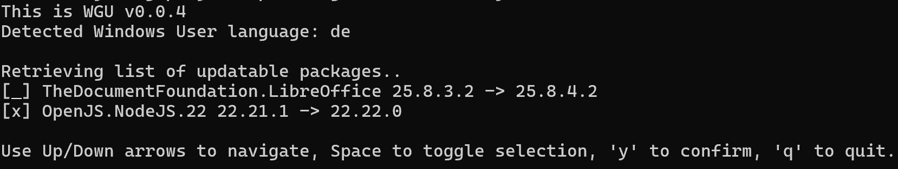

# win-get-updates

Third party CLI frontend for [winget](https://en.wikipedia.org/wiki/Windows_Package_Manager) update runs. It lets you interactively choose which package to install.



## Requirements

Windows with [winget](https://en.wikipedia.org/wiki/Windows_Package_Manager) installed. Supposed to run on cmd.exe.

## Install

```
npm install -g win-get-updates
```

## Run

### Global

```
wgu
```

### Local development

```
node src\cli.js
```

## Ignore File

wgu supports ignoring specific packages from the update list using an ignore file.

### Default Location

By default, wgu loads package IDs to ignore from `~/.wguignore` (in your home directory). If this file doesn't exist, all packages will be shown.

### Custom Ignore File

You can specify a custom ignore file using the `--ignore-file` option:

```
wgu --ignore-file C:\path\to\myignore.txt
```

### Format

The ignore file should contain one package ID per line. Package IDs are matched case-insensitively.

Example `.wguignore`:

```
# Packages I want to update manually
Microsoft.VisualStudioCode
Node.js

# System packages
Microsoft.WindowsTerminal
```

- Lines starting with `#` are treated as comments and ignored
- Empty lines are ignored
- Leading and trailing whitespace is automatically trimmed

## Update dependencies

- Run once:

```
npm install -g npm-check-updates
```

- Run every time:

```
ncu -c 3 --peer -ui
```
